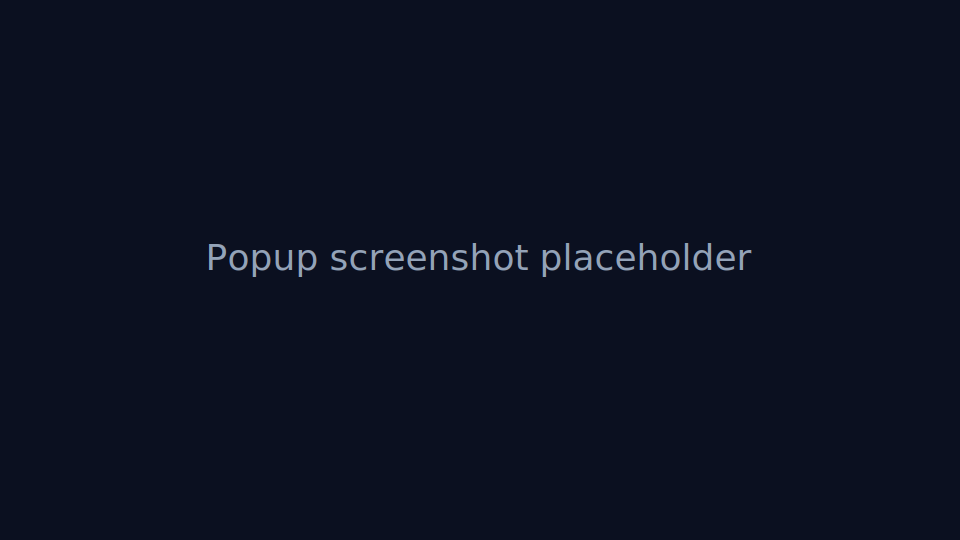
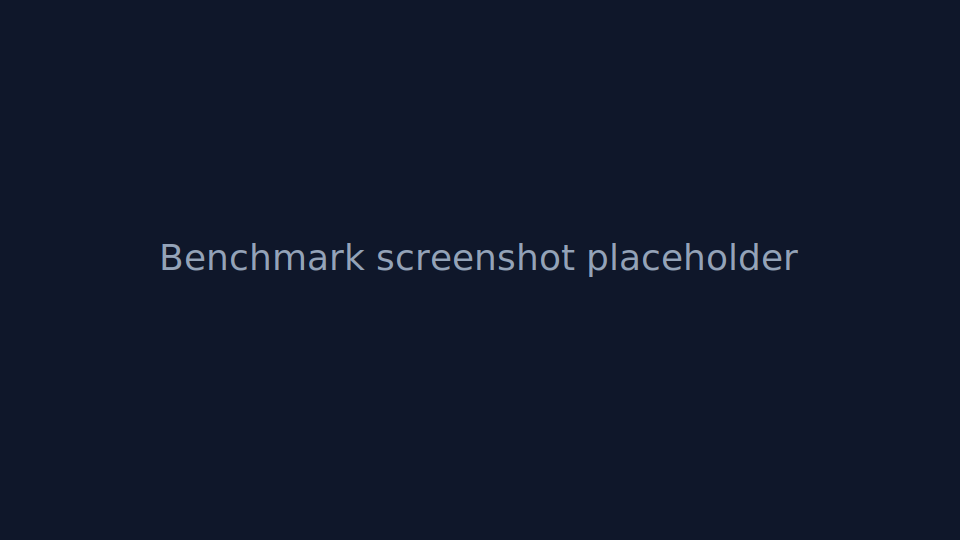

# OptiShield

**Optical Privacy for the Modern Web**

OptiShield is a Manifest V3 browser extension that applies subtle visual perturbations intended to reduce readability from security cameras, low-bitrate surveillance systems, distant smartphone capture, OCR systems, and video-based frame reconstruction while preserving normal direct human readability.




## Ethical positioning

OptiShield is privacy protection for people using screens in public or semi-public spaces. It is designed for shoulder-surfing resistance, optical privacy, and reduced surveillance readability. It is not anti-forensics tooling, stealth software, malware, or a way to hide from browser compromise.

## What it does

- Adaptive pixel perturbation using subpixel jitter, micro luminance variation, RGB channel offsets, temporal variation, and low-amplitude frequency disruption.
- Canvas 2D fallback renderer for low-end devices and Chromebooks.
- WebGL renderer for GPU-accelerated shader-based perturbation where available.
- Adaptive frame timing and inactive-tab pausing for battery and performance.
- Local-only OCR benchmark using Tesseract.js.
- Accessibility controls for reduced motion, low eye strain, dyslexia-friendly tuning, intensity sliders, high-contrast compatibility, and per-site disable lists.

## What it does not prevent

OptiShield does **not** prevent screenshots, malware, spyware, browser compromise, remote desktop capture, developer tools extraction, or direct digital capture. It only attempts to reduce optical capture quality.

## Privacy guarantees

OptiShield collects no telemetry, fingerprints no users, sends no browsing data externally, loads no remote code, requires no accounts, and includes no analytics. Settings are stored only with `chrome.storage.local`.

## Quick start (no build needed)

This repository is directly loadable after download/unzip: the root contains `manifest.json`, `popup.html`, `options.html`, `background.js`, `content.js`, and `icons/` in standard Chromium extension layout. A mirrored build also exists in `dist/`.

1. Download/unzip or clone this repository
2. Open `chrome://extensions`
3. Enable **Developer mode**
4. Click **Load unpacked**
5. Select the repository root folder (`Browser-Extension/`)

If you prefer generated output only, select `dist/` instead.

## Development

```bash
npm install
npm run dev
npm run build
```

After building, either load the repository root or `dist/` as an unpacked extension in a Chromium-based browser.

## Performance expectations

Default settings are intentionally conservative. On weak systems, choose Canvas 2D or reduce frequency disruption and intensity. The extension pauses rendering while the tab is inactive.

## Limitations

Optical privacy is probabilistic and environment-dependent. Camera distance, lens quality, lighting, compression, display type, capture angle, and OCR model quality all affect results.

### Visual activation check

The effect only runs on normal web pages where Chrome allows content scripts; it will not appear on `chrome://` pages, the Chrome Web Store, or other restricted browser UI. On a normal site, the default profile now shows a subtle cyan/scanline perturbation plus a very faint viewport edge outline so you can confirm the overlay loaded. If you still see no change, open the popup and verify protection is **On**, the site is not in the per-site disable list, and the intensity slider is above zero.
